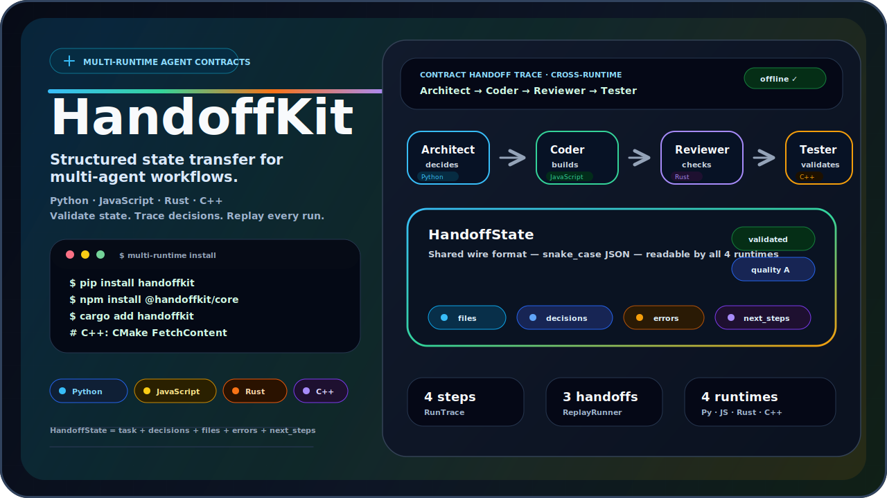
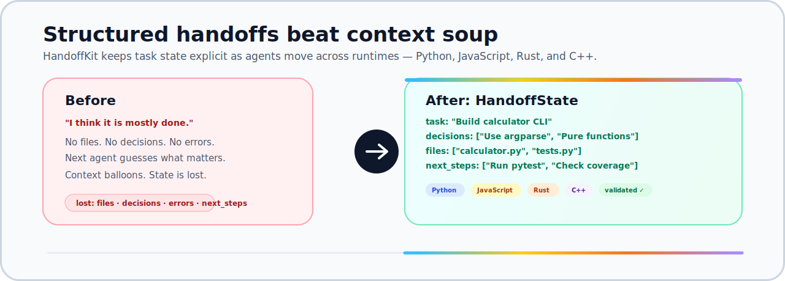
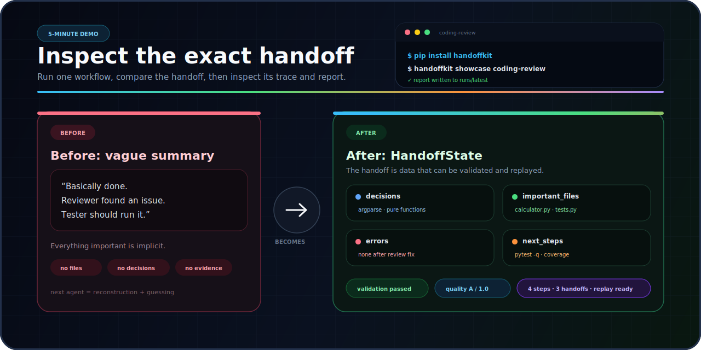
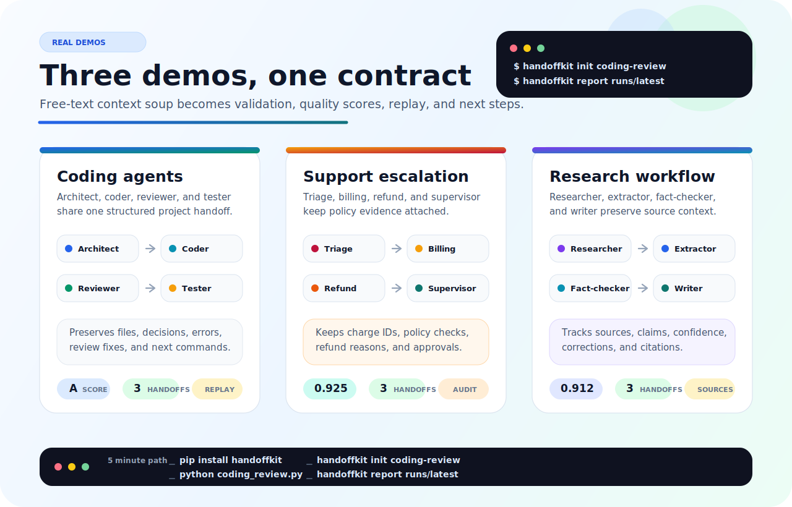
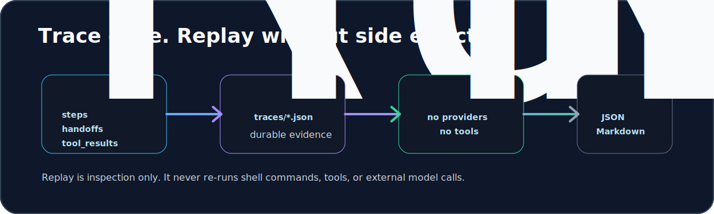
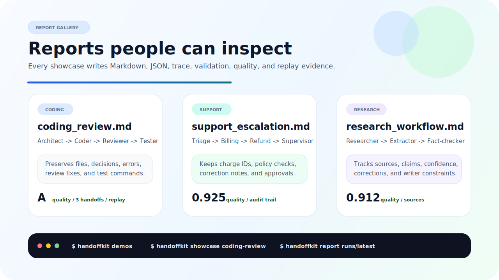

<div align="center">



# HandoffKit

**Contract-first infrastructure for multi-agent workflows.**

Move tasks, decisions, files, errors, evidence, and next steps between agents as
validated data instead of fragile chat summaries.

[](https://github.com/DaosPath/handoffkit/actions)
[](CHANGELOG.md)
[](https://pypi.org/project/handoffkit/)
[](https://www.npmjs.com/package/@handoffkit/core)
[](packages/cpp/README.md)
[](LICENSE)

[Quick start](#quick-start) · [Runtime status](#runtime-status) · [Native Fusion](#native-c-fusion) · [Documentation](docs/README.md) · [Roadmap](ROADMAP.md)

</div>

---

## Why HandoffKit

Multi-agent systems often pass one large conversation from step to step. That
works for a demo, but it makes production workflows difficult to inspect,
validate, replay, or move between runtimes.

HandoffKit gives every transition an explicit contract:

```json
{
  "task": "Ship the authentication feature",
  "from_agent": "Architect",
  "to_agent": "Coder",
  "summary": "The API contract and threat model are ready.",
  "decisions": ["Use short-lived JWTs", "Rotate refresh tokens"],
  "important_files": ["auth.py", "tests/test_auth.py"],
  "errors": [],
  "next_steps": ["Implement login", "Run security tests"]
}
```



| Principle | What it means |
|---|---|
| **Contract-first** | Agents exchange JSON-friendly state with known fields and validation rules. |
| **Cross-runtime** | Python, JavaScript, C++, and Rust contract types share the same `snake_case` wire format. |
| **Observable** | Runs can produce traces, timelines, reports, validation results, and quality scores. |
| **Offline-first** | Echo providers, fixtures, demos, and most tests run without API keys or network calls. |

---

## Quick start

### Python

```bash
pip install handoffkit
handoffkit demos
handoffkit showcase coding-review
handoffkit report runs/latest
```

### JavaScript / TypeScript

```bash
npm install @handoffkit/core
npm install @handoffkit/node       # optional filesystem helpers
```

```javascript
import { Agent, HandoffProtocol, Team } from "@handoffkit/core";

const team = new Team({
  agents: [
    new Agent({ name: "Architect", role: "Plan the work." }),
    new Agent({ name: "Reviewer", role: "Review the handoff." }),
  ],
  protocol: new HandoffProtocol({ mode: "hybrid_state" }),
});

const result = await team.arun("Prepare a release checklist.");
```

### C++20

```bash
cmake -S packages/cpp -B packages/cpp/build -DCMAKE_BUILD_TYPE=Release
cmake --build packages/cpp/build --config Release
ctest --test-dir packages/cpp/build -C Release --output-on-failure
```

```cpp
#include <handoffkit/handoffkit_core.hpp>

using namespace handoffkit;

std::vector<Agent> agents;
agents.emplace_back("Architect", "Plan the work", EchoProvider().as_any());
agents.emplace_back("Reviewer", "Review the handoff", EchoProvider().as_any());

Team team(std::move(agents), HandoffProtocol(ProtocolMode::HybridState));
auto result = team.run("Prepare a release checklist");
```



---

## Runtime status

HandoffKit uses one version across the monorepo, but each runtime has a clearly
defined maturity level.

| Runtime | Status | Distribution | Main surface |
|---|---|---|---|
| **Python 3.10–3.14** | Production runtime | [PyPI `handoffkit`](https://pypi.org/project/handoffkit/) | Agents, teams, tools, providers, recipes, traces, replay, reports, benchmarks |
| **JavaScript / TypeScript** | Production runtime | npm packages under `@handoffkit/*` | Browser-safe core, Node storage, providers, recipes, templates, CLI |
| **C++20** | Native runtime ready for local and Conan use | CMake install, Conan recipe, vcpkg overlay; registry publication pending | Runtime core, providers, tools, reports, web explorer, training jobs, native Fusion |
| **Rust** | Contract layer under construction | Source only; **not published to crates.io** | Serde contract types and cross-runtime fixture parity tests |

Runtime documentation:
[Python](packages/python/README.md) ·
[JavaScript](packages/js/README.md) ·
[C++](packages/cpp/README.md) ·
[Rust](packages/rust/README.md)

---

## What ships in 1.14.2

| Area | Included |
|---|---|
| **Structured handoffs** | `HandoffState`, protocol modes, shared schemas, Markdown and JSON serialization |
| **Agent runtimes** | Agent/team execution in Python, JavaScript, and C++ |
| **Validation and quality** | Contract validators, tool schema checks, deterministic handoff quality scoring |
| **Tools and providers** | Tool registries, safe local tools, provider adapters, registries, selection, and fallbacks |
| **Trace and replay** | Durable run traces, stores, replay summaries, timelines, JSON and Markdown reports |
| **Workflow composition** | Recipes, templates, extensions, project context, memory, and showcase workflows |
| **Native C++ Fusion** | Tiered multi-agent synthesis with role packs, configurable prompts, DAG execution, cache, persistence, and quality contracts |

The canonical wire contracts and cross-runtime fixtures live in
[`packages/contracts`](packages/contracts/README.md). Contract drift becomes a
CI failure instead of a production surprise.

---

## Demos that produce evidence



| Workflow | What remains attached | Run |
|---|---|---|
| **Coding agents** | Files, design decisions, review findings, commands, and test evidence | `handoffkit showcase coding-review` |
| **Support escalation** | Charge IDs, policy checks, refund reasons, approvals, and escalation context | `handoffkit showcase support-escalation` |
| **Research workflow** | Sources, claims, confidence, corrections, citations, and writer constraints | `handoffkit showcase research-workflow` |

Additional offline demos cover media workflows, tools, structured outputs,
provider formats, memory, project context, evaluations, medical research
benchmarks, and Fusion-style panels.

- [Python demo index](docs/python/demos/README.md)
- [JavaScript demo index](docs/js/demos/README.md)
- [C++ demo index](docs/cpp/demos/README.md)
- [Rust demo index](docs/rust/demos/README.md)

---

## Trace, replay, and reports

A completed run can become durable evidence without repeating provider calls or
tool side effects.



```python
from handoffkit import FileTraceStore, ReplayRunner, RunTrace

trace = RunTrace.from_team_result(result, name="coding-review")
FileTraceStore("runs").save(trace)

summary = ReplayRunner(trace).summary()
print(summary.to_markdown())
print(trace.to_timeline())
```



Golden reports used by demos and tests live under
[`packages/python/examples/fixtures/reports`](packages/python/examples/fixtures/reports/README.md).

---

## Native C++ Fusion

Fusion is HandoffKit's optional native C++ synthesis engine. It runs planned
multi-agent call graphs with structured handoffs and progressively stronger
quality contracts.

| Tier | Planned calls | Intended use |
|---|---:|---|
| **Lite** | 3 | Fast, compact synthesis |
| **Medium** | 3 | Balanced default with stronger structure |
| **Pro** | 5 | Multiple proposals plus critique and merge |
| **Ultra** | 5 | Wider DAG execution with stronger evidence checks |
| **Genius** | 8 | Six architect branches, synthesis, and final meta-judge |

```bash
handoffkit-cli fusion tiers
handoffkit-cli fusion explain --tier genius --profile research
handoffkit-cli fusion --provider echo --tier medium --prompt "Compare A and B."
```

Fusion supports JSON configuration, external role packs, custom prompt packs,
phase-specific generation settings, bounded parallel branches, persistence,
cache isolation, resume, provider routing, and local offline validation.

- [Fusion architecture and complete audit](docs/cpp/fusion/README.md)
- [Fusion configuration](docs/cpp/fusion/CONFIGURATION.md)
- [Fusion role packs](docs/cpp/fusion/ROLE_PACKS.md)
- [Fusion changelog](docs/cpp/fusion/CHANGELOG.md)

---

## Monorepo map

```text
handoffkit/
├── packages/
│   ├── contracts/        shared schemas and cross-runtime fixtures
│   ├── python/           production Python runtime and CLI
│   ├── js/               core, node, providers, recipes, templates, CLI
│   ├── cpp/              native C++20 runtime, CLI, tools, and Fusion
│   ├── cpp-ml/           optional native training complement
│   └── rust/             Rust contract layer and parity tests
├── apps/
│   └── web/              Next.js Studio and documentation experience
├── docs/
│   ├── cpp/fusion/       canonical Fusion documentation
│   ├── python/           Python guides, integrations, and launch material
│   ├── js/               JavaScript documentation hub
│   ├── rust/             Rust documentation hub
│   └── assets/           shared README diagrams
└── reports/              selected repository-level report examples
```

Start at the [documentation hub](docs/README.md) for language-specific guides.

---

## Development

```bash
git clone https://github.com/DaosPath/handoffkit.git
cd handoffkit
pnpm install

pnpm js:check
pnpm js:test
pnpm python:lint
pnpm python:test
cargo test --manifest-path packages/rust/Cargo.toml

cmake -S packages/cpp -B packages/cpp/build -DCMAKE_BUILD_TYPE=Release
cmake --build packages/cpp/build --config Release
ctest --test-dir packages/cpp/build -C Release --output-on-failure
```

Normal tests are designed to run offline. Live provider tests and network access
must be explicitly enabled and supplied with scoped credentials.

---

## Project documentation

- [Documentation hub](docs/README.md)
- [Changelog](CHANGELOG.md)
- [Roadmap](ROADMAP.md)
- [Contributing guide](CONTRIBUTING.md)
- [Security policy](SECURITY.md)
- [Python API stability](docs/python/API_STABILITY.md)
- [Release process](docs/python/RELEASE_PROCESS.md)

## License

MIT — see [LICENSE](LICENSE).
