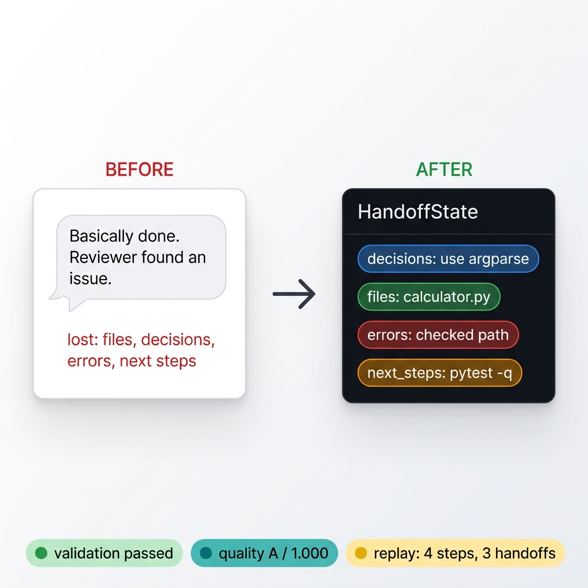
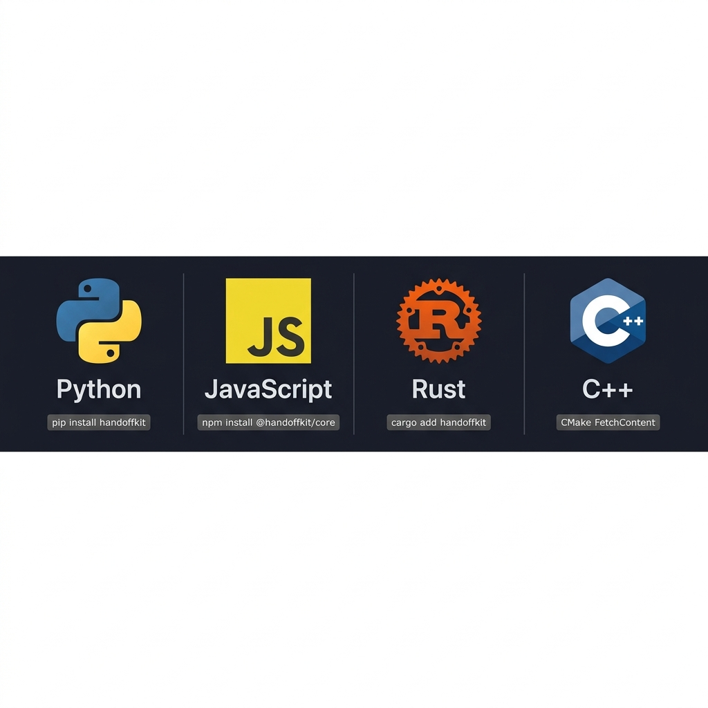
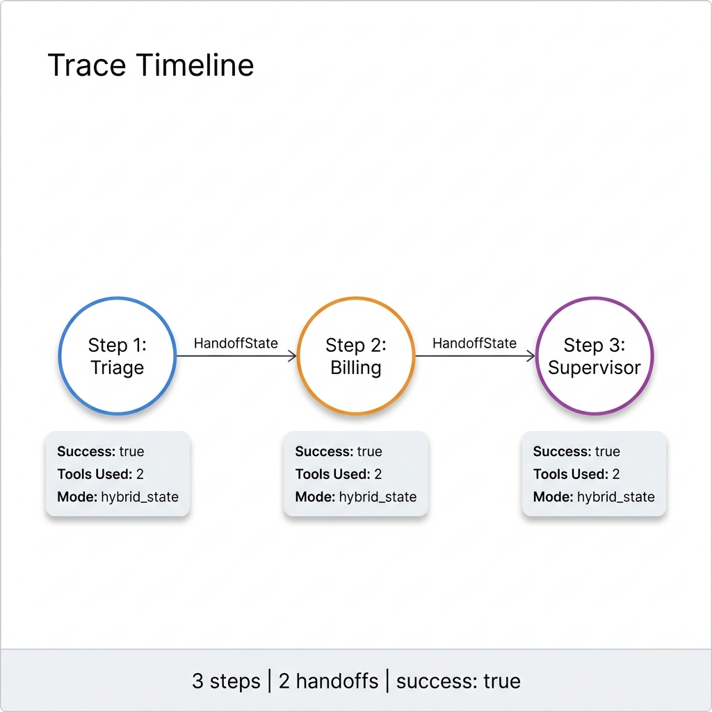

# HandoffKit

[](https://github.com/DaosPath/handoffkit/actions)
[](https://pypi.org/project/handoffkit/)
[](https://www.npmjs.com/package/@handoffkit/core)
[](https://github.com/DaosPath/handoffkit/blob/main/LICENSE)

**HandoffKit** is a language-agnostic, cross-runtime framework for building multi-agent teams with **Structured State-Transfer Protocols**. It provides a unified contract layer, execution model, tool registries, context retrievers, and tracing utilities across **Python, JavaScript/TypeScript, Rust, and C++**.

By standardizing the state (the "handoff") transferred from one agent to another using deterministic JSON schemas, HandoffKit allows you to build agents in different languages that collaborate seamlessly in a single pipeline **without context pollution**.

---

## The Problem: Context Soup → Structured Contract

When agents relay work through free-text summaries, critical information gets lost at every transition.



> **Before:** `"Basically done. Reviewer found an issue."` — files, decisions, errors, and next steps disappear.
>
> **After:** A `HandoffState` object that travels as data, not as a fragile paragraph — with validation, quality scoring, and full replay evidence.

---

## Supported Runtimes



| Runtime | Package | Install |
|---|---|---|
|  **Python** | `handoffkit` | `pip install handoffkit` |
|  **JavaScript** | `@handoffkit/core` | `npm install @handoffkit/core` |
|  **Rust** | `handoffkit` | `cargo add handoffkit` |
|  **C++** | `handoffkit` | CMake `FetchContent` |

---

##  State-Transfer Protocols

When routing tasks between agents, standard conversation histories quickly become cluttered with context drift. HandoffKit introduces three optimized state-transfer protocols:

* **`hybrid_state`** — The default. Transports the complete structured `HandoffState` (decisions, modified files, errors, next steps) inside a system contract boundary alongside conversation history.
* **`natural_handoff`** — Minimizes schema overhead by compiling the handoff state directly into a natural narrative summary injected seamlessly into the chat history.
* **`compressed_state`** — Compresses metadata payloads to reduce prompt token consumption in complex or long-running multi-agent pipelines.

---

##  Monorepo Structure

```text
handoffkit/
  packages/
    contracts/       # Shared JSON schemas and cross-runtime test fixtures
    python/          # Python package published to PyPI as handoffkit
    js/              # JavaScript contract package published as @handoffkit/core
    rust/            # Rust crate with serde serialization support
    cpp/             # C++ library with CMake, Conan, and nlohmann_json support
  apps/
    web/             # Next.js showcase app and developer documentation
  docs/
    img/             # Diagrams and visual assets for README and documentation
```

---

##  Symmetrical Code Examples

<details>
<summary> <strong>Python</strong></summary>

```python
from handoffkit import HandoffState

state = HandoffState(
    task="Implement user authorization",
    from_agent="Architect",
    to_agent="Coder",
    summary="API contract is finalized.",
    decisions=["Use JWT authentication", "Store secrets in env"],
    important_files=["auth.py", "pyproject.toml"],
    next_steps=["Write unit tests", "Create login handler"]
)

markdown_report = state.to_markdown()
json_payload    = state.to_json()
loaded          = HandoffState.from_markdown(markdown_report)
```

</details>

<details>
<summary> <strong>JavaScript / TypeScript</strong></summary>

```javascript
import { HandoffState } from "@handoffkit/core";

const state = new HandoffState({
  task: "Implement user authorization",
  fromAgent: "Architect",
  toAgent: "Coder",
  summary: "API contract is finalized.",
  decisions: ["Use JWT authentication", "Store secrets in env"],
  importantFiles: ["auth.js", "package.json"],
  nextSteps: ["Write unit tests", "Create login handler"]
});

const markdownReport = state.toMarkdown();
const jsonPayload    = state.toJSONString();
const loaded         = HandoffState.fromMarkdown(markdownReport);
```

</details>

<details>
<summary> <strong>Rust</strong></summary>

```rust
use handoffkit::HandoffState;

let state = HandoffState {
    task: "Implement user authorization".to_string(),
    from_agent: "Architect".to_string(),
    to_agent: "Coder".to_string(),
    summary: "API contract is finalized.".to_string(),
    decisions: vec!["Use JWT authentication".to_string()],
    important_files: vec!["Cargo.toml".to_string()],
    errors: vec![],
    next_steps: vec!["Write unit tests".to_string()],
    context_refs: vec![],
    metadata: std::collections::HashMap::new(),
};

let markdown_report = state.to_markdown();
let loaded          = HandoffState::from_markdown(&markdown_report);
```

</details>

<details>
<summary> <strong>C++ (C++17)</strong></summary>

```cpp
#include <handoffkit/handoff.hpp>
using namespace handoffkit;

HandoffState state;
state.task          = "Implement user authorization";
state.from_agent    = "Architect";
state.to_agent      = "Coder";
state.summary       = "API contract is finalized.";
state.decisions     = {"Use JWT authentication"};
state.important_files = {"CMakeLists.txt"};
state.next_steps    = {"Write unit tests"};

std::string markdown_report = state.to_markdown();
HandoffState loaded         = HandoffState::from_markdown(markdown_report);
```

</details>

---

##  Trace Timeline Visualization

Use `RunTrace.to_timeline()` (Python/Rust/C++) or `trace.toTimeline()` (JS) to render a structured chronological execution summary for any multi-agent run.



```
# Execution Timeline: Support Escalation (Run ID: run-9c2b-4e81)
- Success: true  |  Steps: 3  |  Handoffs: 2

1. [Triage]     -> Task: Classify customer issue
   - Mode: hybrid_state | Tools Used: 1 | Success: true
   - [Handoff] Triage -> Billing

2. [Billing]    -> Task: Inspect billing records
   - Mode: hybrid_state | Tools Used: 2 | Success: true
   - [Handoff] Billing -> Supervisor

3. [Supervisor] -> Task: Approve refund request
   - Mode: compressed_state | Tools Used: 1 | Success: true
```

---

##  Quick Start

### Prerequisites

* [Node.js](https://nodejs.org/) v22+ · [pnpm](https://pnpm.io/) v11+ · [Python](https://www.python.org/) v3.10+ · [Rust](https://www.rust-lang.org/) · [CMake](https://cmake.org/) v3.15+

### Install

```bash
git clone https://github.com/DaosPath/handoffkit.git
cd handoffkit
pnpm install
```

### Run Tests

```bash
# JavaScript
pnpm js:test

# Python
pnpm python:test

# Rust
cd packages/rust && cargo test

# C++
cd packages/cpp && cmake -B build && cmake --build build --config Release
ctest --test-dir build -C Release --output-on-failure
```

---

##  Roadmap

| Version | Feature |
|---|---|
| `1.9.0` | Go (Golang) runtime package |
| `1.9.x` | Cross-runtime benchmark suite |
| `2.0.0` | Interactive RunTrace web visualizer (Next.js) |

---

## License

HandoffKit is open-source software licensed under the [MIT License](LICENSE).
